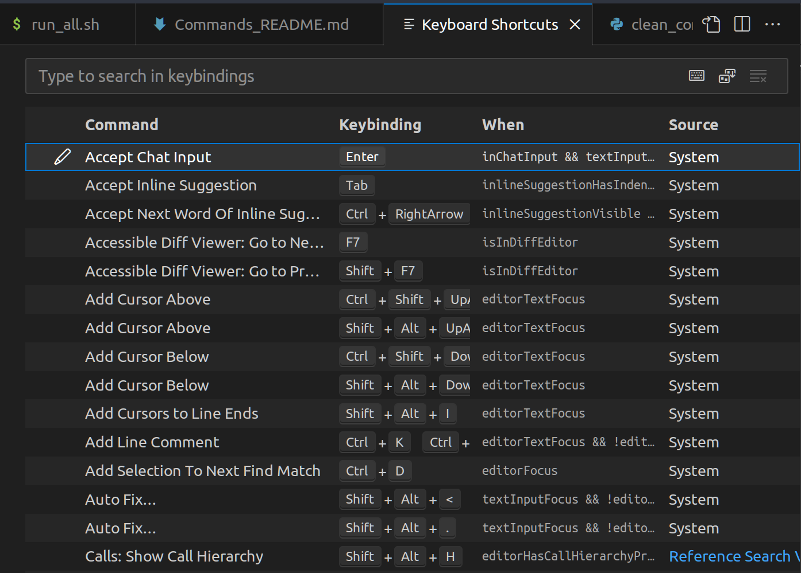

# NLP and backend 

The following instruction assumes that you are doing everything under this folder, `NLP_and_backend`. 

## Dependencies

In `requirements.txt`. 

The workflow: 


## Getting the commands

It is surprisingly hard to find the list of built-in commands of VS Code, so we generate the commands based on the keyboard shortcuts. To access of keyboard shortcuts, 
0. Be sure that there is no extensions/plug-ins installed via MarketPlace. Thus only commands that are built-in in VSCode can be covered below. 
1. Open the VS Code Palette by `View->Command Palette` or `Ctrl/Cmd Shift P`.
2. In the Command Palette, search for `Open Default Keyboard Shortcuts (JSON)` and press Enter, then a file will open.
3. Save the file as `default_keybindings.jsonc`.

## Getting the titles (English description) of commands
0. Copy this string - "test" into the system clipboard by highlighting it and pressing Ctrl/Cmd + C (don't copy the quotes)
1. Set up the specific window arrangement for `get_command_titles_using_gui.py` to simulate manual operations. In VSCode, press `Ctrl/Cmd-Shift-P` and enter "Open Keyboard Shortcuts" which will bring up a table view of commands. 
   
2. Run the script `get_command_titles_using_gui.py` Note that our script hardcode the coordinates of mouse clicks to be simulated, assuming that the desktop resolution to 1920x1080 and the VSCode window is maximized. If you have a different resolution, you need to adjust the values accordingly. 
   ```python
   pyautogui.click(x=1000, y=120, clicks=6, button='left')
   pyautogui.typewrite('@command:' + keys_list[i])
   pyautogui.click(x=1000, y=200, clicks=1, button='right')
   pyautogui.click(x=1200, y=295, clicks=1, button='left')
   ```
3. The script `get_command_titles_using_gui.py` will take about 1 hour to run to simulate the manual operation of searching for a command (extracted from `default_keybindings.jsonc`) and using the right click on the Keyboard Shortcut table to "Copy command title." Leave your computer alone until it finishes. 
    

## Preprocessing and pre-embed the commands 

```shell
python3 clean_commands.py
python3 embed_commands.py
```

`clean_commands.py` does several things. It breaks a command, which is a dot-separated, camel-case string into a list of words, e.g., `python.clearWorkspaceInterpreter` into "python clear workspace interpreter". 
Then it normalizes all strings, either from commands or titles. 

Configurations for embedding the commands are in `config.py`. Currently we only support Sentence-Transformer/SBERT-based embedding because we love dot-products. 
`embed_commands.py` will result in one pickle file containing a two-column Python lists of floats: the first column being the embeddings of command strings (e.g., `python.clearWorkspaceInterpreter` ) and the second column being the embeddings of command title strings: 
|embeddings of commands | embeddings of titles | 
| --------------------- | ------------------- | 
|[0.34, 0.13, -0.45, ...]| [0.3, -0.743, 0.74, ...] | 
| ... | ... | 

## Starting the backend server

It's just like starting a normal FastAPI app: 

```shell
uvicorn app:app --reload
```

## Endpoints and query formats

Please see [project README](../README.md#nlp-and-backend). 

## Caveats

1. The commands are not exactly the same as you see when searching in the palette. For example, when you search `add cursor above`, in the palette, it shows as `Add Cursor Above`, but the command is `editor.action.insertCursorAbove`. `Add Cursor Above` is called `label` of the command, `editor.action.insertCursorAbove` is called `id` of the command. We are still working on extracting all commands provided by VSCode and extensions. 

# BELOW IS KEPT FOR REFERENCE

## Next step: Commands from Marketplace extensions

### plugInCommandsOutput.json
Contains a list of all VSCode extension commands installed on the system. This only includes plug in commands from plug ins that were installed by the user, from the Marketplace. This file was obtained by running `PlugInCommands.py`.

## File structure

### Scripts

* `run_all.sh`: The shell script to do everything preparing the data and files, and even packing the zip file for Google Cloud Functions hosting. To save clod-start time, we pack the language model into the package. 
* `config.py`: The central location of all configurations, used by many other scripts. 
* `clean_commands.py`: Preprocessing VSCode commands accessible via `keybindings.json` file
* `embed_commands.py`: Pre-embed all commands using a model specified.
* `search_commands.py`: Command search functions and a demo which accepts a query and parameters from `sys.argv`. Needed by fastAPI and GCP `functions_framework` apps. 
* `fastapi_app.py`: A fastAPI app to do command search locally. 
* `main.py`: The app in `functions_framework` for hosting in Google Cloud Functions (GCF) service. We hate to call it `main.py` but it seems GCF has bugs. 

### Data files
* `keybindings.json`: Command shortcut configuration file in VSCode, resaved. Some commands have shortcut keys while others do not. 
* `commands_processed.json`: Commands normalized from above using `clean_commands.py`. 
* `command_embeddings_{approach}_{model}.py`: Embeddings of commands by `embed_commands.py` using a model specified in `config.py`.
