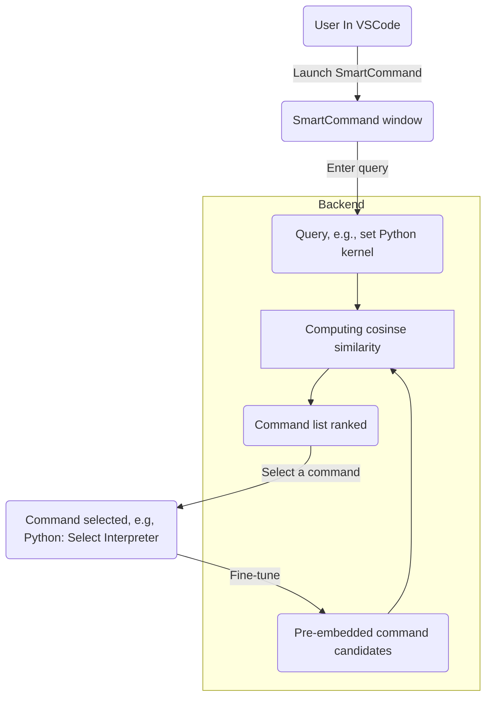

# SmartCommand 4 VSCode: semantic fuzzy command palette for VSCode

SmartCommand is a VSCode plug-in to allow users find commands without precisely using the right words in the Command Palette fashion. 
Currently, VSCode's default and official Command Palette (`Ctrl-Shift-P`) does only string matching. 
You cannot even set the Python interpreter using the query "set Python kernel", because in Command Palette the right command is "Python: Select Interpreter". 
In short, it's like a chatGPT-powered Command Palette. 

SmartCommand is available at [VSCode Marketplace](https://marketplace.visualstudio.com/items?itemName=SigmaWe.smart-command). 
After installation, press the shortcut key binding `ctrl+alt+q` (`shift+cmd+q` on Mac) to bring up the SmartCommand palette, which you can use as in the official Command Palette. 

If you want to help us improve its model, you can enable the data collection option which is disabled by default. 
We promise that SmartCommand will keep the models trained using your data open to the general public. 

SmartCommand is open source and we are deciding between MIT, Apache, and BSD, in terms of the license.

## Folder structure
* NLP_and_backend: All scripts related to the NLP core part of this project, including preprocessing data, pre-embedding commands, testing different strategies. The backend app is in `NLP_and_backend/app.py`
* Plugin: The VSCode plug-in itself (currently going over refactorization). 

## Architecture



## NLP and Backend

At our backend, we leverage Sentence-Transformer (also known as the SBERT or Sentence-BERT). 

1. `Search`: 
    * Method: GET
    * Request body (all kwargs) and example: 
        ```json
        {
            "q": "markdown preview", 
            "k": 15, 
            "p": 0.1
        }
        ```
    * Response: 
        ```json
        ["command 1", "command 2", "command 3", ...] 
        ```

2. `Feedback`: not implemented yet

**Content below are to be updated***

## Building and running the plug-in locally

### Prepare required software and files

Folliwing the official vscode extension tutorial [here](https://code.visualstudio.com/api/get-started/your-first-extension)
Make sure you have Node.js and Git installed, then install Yeoman and VS Code Extension Generator with:

`npm install -g yo generator-code`

### Create new extension

run `yo code` to create a new extension. THen it will ask your choice on some initial options. Choose the Typescript to create the new extension and name it as `smart command`. It is fine to just use the default for other options.
After creating the new extension, you need to install the `node-fetch` by running 
```
cd smart-command
npm install node-fetch@2
```
Then copy the folder `plugin/smart-command` to the new extension and replace the files.

### Run the plugin locally

Open the folder Plugin/text2command in VSCode locally. Use F5 to run the plugin and it will open a new VSCode window. Open command palette in that new VSCode window and search NLPSearch command. Check the plugin Readme file for extension usage guides.

### Known issues

If it shows error after press F5 to run the plugin, one can choose debug anyway to temporaily ignore it and continue.
