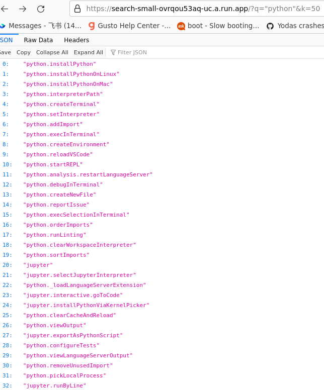

# Refactorized backend, initial report

Now you can try our refactorized backend at https://search-small-ovrqou53aq-uc.a.run.app/?q=%22set%20python%20kernel%22&k=50 
Only three parameters to be passed in the URL via GET:
* `q` for your query, space separated terms, 
* `k` and `p` for [top-k and top-p](https://docs.cohere.ai/docs/controlling-generation-with-top-k-top-p) cutoffs. 

This model takes about 500ms to run on a Google Cloud Functions (GCF) instance of 1 vCPU and 2 GiB RAM. We keep one minimal instance to save cold-start time which will cost us about $20/mo for 100k calls per month after GCF's perpetual free tier. 

**The initial result** is good, despite of using dot product on embeddings from a [80MB model](https://huggingface.co/sentence-transformers/all-MiniLM-L6-v2) which is not even the best amoung the SBERT family (see [leader board](https://www.sbert.net/docs/pretrained_models.html)). Now if you type `choose python`, setting Python's interpreter or Jupyter's kernel is amount top 10 candidates.

**Recall that our goal is** to build a command palette for VSCode that users can do semantic fuzzy search. Currently, VSCode's Command Palette only does string search and the token order matters. It does not even do unigram!) 

We are surprised that the LM even knows the similarity between "python" and "jupyter". See the screenshot below.

But, it does not seem to know the similarity between "kernel" and "interpreter" in the programming language context.

Stay tuned! We are designing new heuristics, and we are working on refactoring the VSCode extension. 